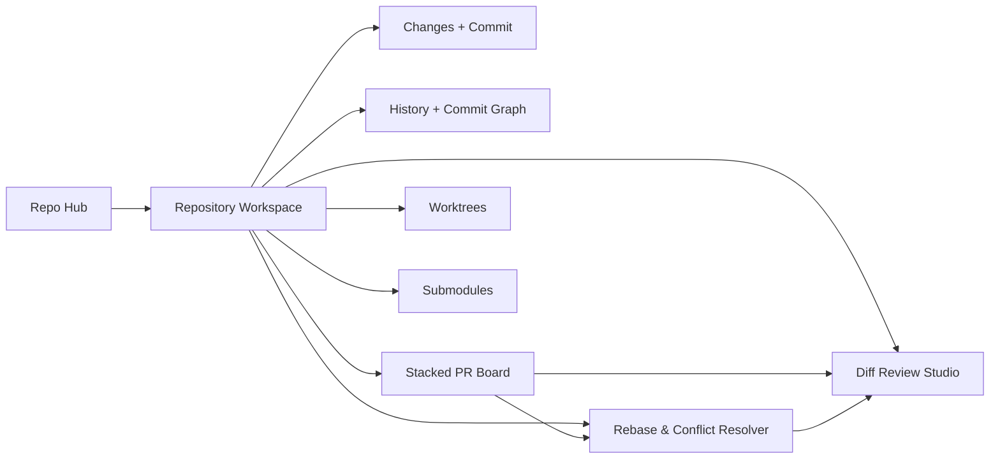

# GitEye Design System and Feature Plan

## Context

The six supplied design references define a dark-first, compact desktop Git client that goes beyond the current GitEye implementation. The target product direction is a polished GitFork/Fork-style app with a macOS-like shell, dense repository workflows, stacked PRs, PR review, worktrees/submodules, and rebase/conflict resolution.

Current implementation already has the foundation for a Tauri + React + TypeScript Git client:

- `src/app/App.tsx` applies the active theme and switches between welcome and repository workspace.
- `src/components/layout/AppShell.tsx` owns the shell structure with toolbar, sidebar, and panel layout.
- `src/components/repository/RepositoryWelcome.tsx` is the current no-repository entry screen.
- `src/components/layout/Toolbar.tsx`, `src/components/layout/Sidebar.tsx`, and `src/components/layout/PanelLayout.tsx` are the main desktop surfaces.
- `src/types/git.ts` currently supports only `history`, `working-tree`, and `settings` views.
- `src/lib/tauri-api.ts` exposes repository, status, commit, branch, remote, and diff commands.
- `src-tauri/src/lib.rs` registers the matching Rust commands; there is no existing PR provider, stacked PR, worktree, submodule, rebase, or conflict resolver API yet.
- `plans/modern-ui-overhaul.md` already covers a prior light/dark visual polish pass, but the new references are broader and should supersede it for product architecture and feature scope.

## Design Reference Inventory

| Image | Screen | Product meaning |
|---|---|---|
| `10_00_42 AM (1).png` | Repo Hub | Global home dashboard for repositories, accounts, activity, clone/new/open actions, team workspaces, and health checks. |
| `10_00_43 AM (2).png` | Repository Workspace | Core local repository view: left navigation, staged/unstaged changes, commit form, commit graph, commit details, stacked PR rail. |
| `10_00_44 AM (3).png` | Stacked PR Board | Stack-aware pull request workflow: reorder, rebase/squash/land/update base, health, summary, reviewers, labels, issues, timeline. |
| `10_00_44 AM (4).png` | Diff Review Studio | PR/file review surface: file tree, side-by-side diff, conversations, suggestions, checks, impacted summary. |
| `10_00_45 AM (5).png` | Submodules & Worktrees | Repository workspace extension for linked repos and multiple working directories with details/actions/activity. |
| `10_00_46 AM (6).png` | Rebase & Conflict Resolver | Guided interactive rebase and conflict resolution with 3-way merge, stack context, AI suggestions, rebase preview, and guarded continuation. |

### Reference Asset Management

After plan approval, move the supplied references into the repository under `design/reference/` so future design and implementation work can cite stable repo-relative paths instead of transient Downloads paths.

| Source image | Proposed repo path |
|---|---|
| `/home/alfkonee/Downloads/ChatGPT Image Jun 3, 2026, 10_00_42 AM (1).png` | `design/reference/repo-hub.png` |
| `/home/alfkonee/Downloads/ChatGPT Image Jun 3, 2026, 10_00_43 AM (2).png` | `design/reference/repository-workspace.png` |
| `/home/alfkonee/Downloads/ChatGPT Image Jun 3, 2026, 10_00_44 AM (3).png` | `design/reference/stacked-pr-board.png` |
| `/home/alfkonee/Downloads/ChatGPT Image Jun 3, 2026, 10_00_44 AM (4).png` | `design/reference/diff-review-studio.png` |
| `/home/alfkonee/Downloads/ChatGPT Image Jun 3, 2026, 10_00_45 AM (5).png` | `design/reference/worktrees-submodules.png` |
| `/home/alfkonee/Downloads/ChatGPT Image Jun 3, 2026, 10_00_46 AM (6).png` | `design/reference/rebase-conflict-resolver.png` |
| Asset index | `design/reference/README.md` with thumbnail list, screen purpose, and feature mapping. |

> [!WARNING]
> During planning mode I cannot move binary files. The implementation pass should create this folder and move the images before UI work starts.

## Approach

Build a cohesive product system in three layers:

1. **Pixel-perfect design system foundation first** — implement the shared visual language and static/reference-accurate screens before requiring every surface to be backed by live Git/provider data.
2. **Navigation and screen architecture** — expand the current `ViewType`/workspace model into explicit global and repository feature areas while keeping a single consistent shell that works across a broad range of desktop window sizes.
3. **Feature implementation plan** — map every visible feature in the references to frontend components, backend Tauri commands, data models, and verification paths, with GitHub as the first remote provider.

> [!IMPORTANT]
> The references are not just visual skins. They imply new product capabilities that need Rust/Tauri Git APIs and remote provider integrations, not only React components.

## Cohesive Design System

### Visual Principles

- **Dark-first desktop surface**: near-black app chrome, deep blue-gray panels, low-glare borders, and high-contrast content.
- **Compact density**: 32-40px toolbar controls, 34-42px table rows, narrow gutters, tight card padding, and persistent status bars.
- **Layered panels**: window background, sidebar, toolbar, main cards, elevated detail panels, popovers, and modal/error states each get distinct elevation tokens.
- **Status-first semantics**: green = clean/pass/up-to-date/resolved, amber = dirty/updates available/warning, red = failed/conflict/dropped/destructive, blue = current selection/navigation, purple = stack/rebase metadata.
- **Graph-aware layout**: branch/commit/stack/rebase timelines use consistent lane colors, node sizes, connector widths, and selected node states.
- **Code-review readability**: monospaced code at compact sizes, stable line-number gutters, red/green/purple conflict backgrounds, and strong current-hunk focus.

### Token Families

| Token family | Planned coverage |
|---|---|
| Color | App chrome, panels, cards, controls, text hierarchy, borders, focus, selection, status, graph lanes, diff states, conflict states, provider badges. |
| Typography | UI sans, mono/code, title scale, section labels, table cells, captions, badges. |
| Spacing | 4px base grid; compact and comfortable density aliases. |
| Radius | Window, card, button, input, badge, avatar, graph node. |
| Elevation | Flat panels, inset sections, raised cards, floating popovers, active drag cards. |
| Motion | Hover, press, drag reorder, panel transitions, sync/fetch progress, conflict resolution state changes. |
| Iconography | Lucide base set with consistent 14/16/18px sizing and colored status/icon tiles. |

### Core Component System

| Component | Needed variants |
|---|---|
| App window shell | Repo Hub shell, repository shell, focused workflow shell. |
| Sidebar | Global navigation, repository tree, worktree/submodule quick sections, account/remotes section. |
| Toolbar | Repo selector, branch selector, Git actions, sync split button, search/command input, notifications/status. |
| Button | Primary, secondary, ghost, danger, success, split-button, icon-only, compact table action. |
| Input | Search, command palette, commit summary/description, filter, URL clone field. |
| Card/panel | Metric cards, details panels, health panels, activity cards, PR cards, conflict panels. |
| Table/tree | File tree, staged/unstaged lists, worktree table, submodule table, checks table. |
| Badge/pill | PR state, branch, labels, counts, status, ahead/behind, review state. |
| Graph/timeline | Commit graph, stack graph, rebase before/after preview, activity timeline. |
| Diff viewer | Unified, split, 3-way conflict, hunk navigation, comments, suggestions. |
| Empty/loading/error | Each feature area gets compact, non-toy states. |

## Feature Plan from Design Files

### Feature Areas

| Area | Screens | Scope implied by designs | Existing support |
|---|---|---|---|
| Repo Hub | Image 1 | Repository dashboard, connected providers, activity feed, clone/open/new, team workspaces, global search. | Partial: recent repositories only. |
| Repository Workspace | Image 2 | Local status, staged/unstaged, commit creation, commit graph, branch health, stacked PR rail. | Partial: status, commit, branches, remotes, diffs, history. |
| Stacked PR Board | Image 3 | Stack reorder, split/squash/land/rebase/update base, PR metadata, stack health, diff summaries. | None. |
| Diff Review Studio | Image 4 | PR files, side-by-side review diff, comments, suggestions, checks, reviewers, impacted summary. | Partial: file diff viewer only. |
| Worktrees/Submodules | Image 5 | Worktree list/create/switch/open, submodule status/update/sync/bump/open, activity. | None. |
| Rebase/Conflict Resolver | Image 6 | Interactive rebase todo, conflict file navigation, 3-way merge, suggestions, rebase preview, guarded continue/abort/skip. | None. |

### Recommended Product Cutover

Implement as a clean product expansion rather than adding isolated screens:

## Files to Modify

Initial critical paths expected to change once implementation begins:

| File/path | Why |
|---|---|
| `design/reference/*.png` | Stable in-repo design references moved from Downloads. |
| `design/reference/README.md` | Index of reference images, screen purposes, and feature mappings. |
| `src/index.css` | Design tokens, global density, scrollbar/focus/selection, app-wide theme variables. |
| `src/types/git.ts` | Expand view types and add models for PRs, stacks, checks, worktrees, submodules, conflicts, rebase todos. |
| `src/stores/app-store.ts` | Add navigation state for global hub, repository workspace views, selected PR/stack/worktree/submodule/conflict. |
| `src/lib/tauri-api.ts` | Add typed client methods for new Rust commands and provider operations. |
| `src-tauri/src/lib.rs` | Register new command modules. |
| `src-tauri/src/commands/*` | Add commands for worktrees, submodules, rebase/conflicts, and GitHub provider data. |
| `src-tauri/src/git/*` | Add Git service implementations using real Git commands. |
| `src/components/layout/*` | Evolve current shell, toolbar, sidebar, panel layout to match references. |
| `src/components/repository/RepositoryWelcome.tsx` | Replace/expand into Repo Hub experience. |
| `src/components/working-tree/*` | Align core changes/commit workflow to image 2. |
| `src/components/commit-history/*` | Align commit graph/details and branch health to image 2. |
| `src/components/diff-viewer/*` | Support review diff and conflict/diff variants. |
| `src/components/*` new feature folders | Add stacked PRs, review studio, worktrees/submodules, rebase/conflicts, activity feed. |

## Reuse

- `src/lib/cn.ts` — class merging helper for component variants.
- `src/stores/app-store.ts` — existing central UI state; extend instead of parallel stores unless domain state becomes too large.
- `src/hooks/useRepository.ts`, `src/hooks/useGitStatus.ts`, `src/hooks/useCommitHistory.ts`, `src/hooks/useBranches.ts` — existing TanStack Query patterns for new hooks.
- `src/lib/tauri-api.ts` — existing typed invoke wrapper pattern.
- `src-tauri/src/git/cli.rs` — likely reusable Git command execution foundation.
- `src-tauri/src/errors.rs` — preserve existing error mapping conventions.
- `src/components/common/*` — common status/empty/error/loading patterns should become design-system primitives.
- `@pierre/diffs` — installed diff rendering dependency for review and conflict surfaces where appropriate.
- `lucide-react` and Radix primitives — existing icon/menu/dialog/tooltip foundations.

## Steps

### Phase A: Preserve references and finalize design system specification

- [ ] Move supplied reference images under `design/reference/` with descriptive filenames before implementation begins.
- [ ] Create `design/reference/README.md` that maps every image to screen purpose, feature scope, and planned components.
- [ ] Extract exact token palette, typography scale, spacing scale, radius scale, elevation rules, and component state matrix from the six images.
- [ ] Define reusable component contracts for toolbar buttons, split buttons, cards, badges, tables, graph lanes, timelines, and diff panels.
- [ ] Use the supplied 1490×1024 references as the visual baseline while supporting a broader range of desktop window sizes from the start.

### Phase B: Navigation and shell architecture

- [ ] Replace the current three-view `ViewType` with global hub + repository workspace feature routes/views.
- [ ] Normalize the app shell so Repo Hub, Repository Workspace, PR Board, Review Studio, Worktrees/Submodules, and Rebase Resolver share chrome and status bars.
- [ ] Define selected entity state: repository, branch, commit, file, PR, stack, worktree, submodule, conflict.

### Phase C: Repo Hub

- [ ] Build dashboard cards for active PRs, local changes, worktrees, and submodules.
- [ ] Add repository lists for recent and favorites.
- [ ] Add clone/open/new repository actions.
- [ ] Add connected GitHub account sections and activity feed placeholders backed by GitHub APIs when credentials exist.

### Phase D: Repository Workspace

- [ ] Refine staged/unstaged/ignored file panels and commit form to match image 2.
- [ ] Add branch health, ahead/behind, sync state, and status bar summaries.
- [ ] Upgrade commit history to a graph-centered list with selected commit details.
- [ ] Add stacked PR rail when GitHub PR metadata is available.

### Phase E: Stacked PR Board

- [ ] Add stack data model, PR card UI, reorder interactions, stack health, and summary panels.
- [ ] Implement safe Git operations for rebase stack, split stack, squash, land stack, and update base only where backend support is complete.
- [ ] Add GitHub-backed PR metadata first: reviewers, labels, checks, linked issues, timeline.

### Phase F: Diff Review Studio

- [ ] Add file tree, tabs for files/conversations/checks, side-by-side diff, comments, suggestions, checks, and impact summary.
- [ ] Reuse existing diff APIs for local diffs and add GitHub-backed PR diff/comment APIs for review workflows.
- [ ] Preserve performance with virtualization for large diffs.

### Phase G: Worktrees and Submodules

- [ ] Add worktree models and commands: list, create, switch/open, remove/prune where safe.
- [ ] Add submodule models and commands: status, update, sync, bump commit, open submodule, recursive flags.
- [ ] Add detail panels and recent activity for selected worktree/submodule.

### Phase H: Rebase and Conflict Resolver

- [ ] Add rebase state detection and interactive todo model.
- [ ] Add command support for pick/edit/squash/drop/reorder, continue, abort, and skip.
- [ ] Add conflict file discovery and 3-way content extraction.
- [ ] Build current/incoming/result merge UI, suggestions panel, and rebase before/after preview.
- [ ] Implement the AI Assistant panel UI as a pixel-perfect shell now, with deterministic placeholder/suggestion states; defer AI core behavior until the later AI feature phase.
- [ ] Guard destructive actions with explicit confirmation and never hide unresolved conflicts.

### Phase I: Verification and design QA

- [ ] Add focused unit/integration tests for data transforms and Git command parsing.
- [ ] Run TypeScript build and Rust checks.
- [ ] Use seeded repositories covering clean/dirty/conflict/submodule/worktree/stacked-branch states for manual QA.
- [ ] Capture screenshots of every reference-mapped screen and compare density, spacing, color, and hierarchy against the supplied images across supported desktop sizes.

## Verification

Implementation verification should include:

1. `bun run build` for TypeScript/Vite production build.
2. `cd src-tauri && cargo check` for Rust command/model validity.
3. Focused tests for any added parsing/state transformation utilities.
4. Manual Tauri QA with repositories that cover:
   - no repository open / Repo Hub
   - clean and dirty repository
   - staged, unstaged, ignored, renamed, deleted, and conflicted files
   - local branch ahead/behind
   - multiple worktrees
   - submodules up to date and behind
   - stacked local branches/PRs
   - active rebase with conflicts
5. Visual QA against all six supplied references at the 1490×1024 baseline and additional desktop window sizes.

## Decisions from Plan Review

1. **Implementation order**: pixel-perfect design system and static/reference-accurate screens first; live Git/provider backing follows per feature.
2. **Reference images**: move the supplied images from Downloads into `design/reference/`; do not leave duplicate originals as part of the implementation workflow.
3. **Remote provider priority**: GitHub first for PR/review/activity data.
4. **Responsive target**: support a broader range of desktop window sizes from the start while preserving the supplied 1490×1024 reference as the visual baseline.
5. **AI conflict/review assistance**: implement the UI shell first; defer AI core behavior to a later feature phase.
